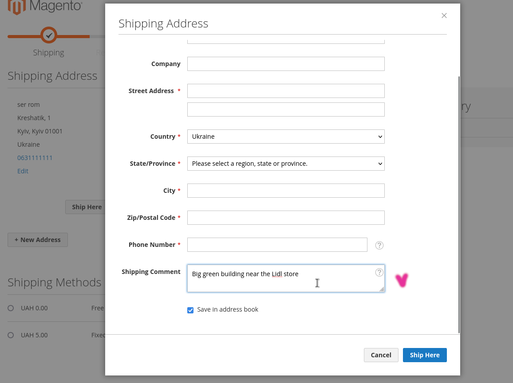

# Add a comment to shipping address

## Description

Magento 2 module adds a comment to checkout shipping address form.

## Features

1. [*shipping step* - a comment field is displayed for guests and customers ( with new address )](#1)
2. [*shipping step* - the comment displayed for existing customer address](#2)
3. [*shipping step* - in address list added *edit* link for each customer address](#3)
4. [*address book* - the comment shown in Default Addresses section](#4)
5. [*address book* the comment field is added for new or existing customer address](#5)
6. [*admin* - the comment is displayed on the Order page ( Sales => Orders => click View on any Order => check Shipping Address )](#6)
7. [*admin* - there are some comment settings](#7)

## Status

The Module is working, testing it. Last preperance.

## Versions

* 1.0.0-beta1   Magento 2.4.7   PHP 8.2.17

##  1. Comment field is displayed for guests and customers ( with new address )

Area - *shipping step* 

### Field is displayed for guests
-   
-   

### Field is displayed for customers with new address
- 
- 

##  2. The comment is displayed for existing customer address

Area - *shipping step*

Saved comment is displayed in address fields list. Customer created the address manually or already placed order.

- 

##  3. In the address list added edit link for each customer address

Area - *shipping step*

*Edit* link to customer edit address form

- 
- 

##  4. The comment shown in the Default Addresses section

Area - *address book*

- 

##  5. The comment field is added for new or existing customer address

Area - *address book*

- 
- 

##  6. The comment is displayed on the Order page 

Area - *admin*

Admin path - Sales => Orders => click View on any Order => check Shipping Address.

- 

##  7. There are some comment settings

Area - *admin*

- 

### Field sort order on checkout page

Change field position in the address fileds list